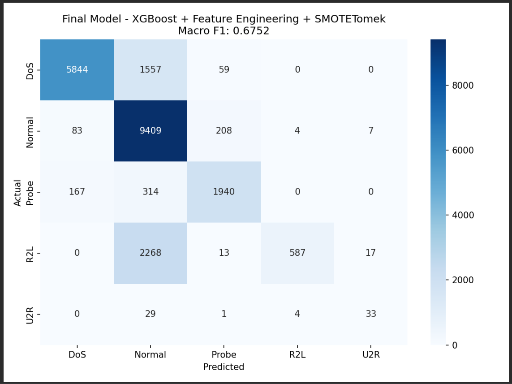

# Network Intrusion Detection — Project Report

## 1. Problem and Dataset

The goal of this project was to build a machine learning model to classify
network connections into 5 categories: Normal, DoS, Probe, R2L and U2R,
using the NSL-KDD dataset (125,973 training records, 22,544 test records).

The main challenge is class imbalance — U2R has only 52 training examples
and R2L has 995, while Normal has 67,343. A model that ignores this will
simply predict Normal for everything and miss all attacks.

The competition metric is macro F1-score, which treats all 5 classes equally
regardless of size. The assignment baseline (Random Forest, default settings)
scored 0.47.

---

## 2. Approaches Tried

We explored two main algorithm families across multiple experiments:
- **Gradient Boosting (XGBoost and LightGBM)** — sequential tree-based
  models that focus on correcting previous errors
- **Random Forest** — ensemble of independent decision trees with
  class balancing

Both tracks used various imbalance handling techniques from the assignment:
SMOTE, SMOTETomek, class weights, and threshold tuning.

---

## 3. Experiments

### Gradient Boosting Track

| Experiment | Approach | Macro F1 |
|---|---|---|
| 1 | XGBoost baseline (no imbalance handling) | 0.5599 |
| 2 | XGBoost + SMOTE | 0.6273 |
| 3 | XGBoost + SMOTETomek | 0.6485 |
| 4 | XGBoost + SMOTE + threshold tuning | 0.6743 |
| 5 | LightGBM + SMOTE | 0.6034 |
| 6 | XGBoost + feature engineering + SMOTETomek + thresholds | **0.6752** |
| 7 | XGBoost + RandomizedSearchCV + feature engineering | 0.6698 |

### Random Forest Track

| Experiment | Approach | Macro F1 |
|---|---|---|
| RF baseline | Default Random Forest | 0.4911 |
| RF balanced | Random oversampling | 0.5700 |
| RF tuned | Tuned Random Forest + class_weight balanced | 0.5900 |
| RF best | Balanced Random Forest (500 trees) | 0.6053 |
| RF SMOTENC | Random Forest + SMOTENC | 0.5800 |

---

## 4. What Worked and What Did Not

**What worked:**
- SMOTETomek consistently outperformed plain SMOTE. The Tomek cleaning
  step removes ambiguous examples near class boundaries, which helped
  the model separate Normal from R2L more clearly.
- Threshold tuning gave consistent improvements. By lowering the decision
  threshold for R2L and U2R, the model flags them more aggressively.
  Thresholds were tuned on a validation split from the training data —
  the test set was only used once for final evaluation.
- Feature engineering helped significantly. The two most important new
  features were total_bytes (src + dst bytes) and total_error_rate
  (sum of all error rates). Correlation analysis removed 7 redundant
  features and importance-based selection removed 4 more.
- Balanced Random Forest improved the rare classes clearly compared
  to default Random Forest — R2L F1 went from 0.03 to 0.36 and
  U2R F1 from 0.06 to 0.33.

**What did not work:**
- Custom class weights (R2L x15, U2R x50) performed worse than
  automatic balancing — the manually chosen values were not better
  than letting the algorithm decide.
- LightGBM (0.6034) was consistently worse than XGBoost on this dataset
  despite being generally faster.
- RandomizedSearchCV found hyperparameters that scored very high on
  cross-validation (CV F1: 0.9997) but generalised worse to the test
  set (0.6698) compared to default parameters (0.6752). The default
  XGBoost settings were already well suited to this problem.
- Random Forest as an algorithm was outperformed by XGBoost across
  all comparable experiments. The best RF result (0.6053) was below
  most XGBoost results.

---

## 5. Final Model

**XGBoost + Feature Engineering + SMOTETomek + Threshold Tuning**

Steps:
1. Add 5 engineered features (byte ratios, error rate totals etc.)
2. Drop 7 highly correlated features (correlation > 0.95)
3. Drop 4 low importance features (bottom 10% by XGBoost importance score)
4. Split training data into 80% train / 20% validation
5. Apply SMOTETomek on training split only
6. Train XGBoost (300 trees, max_depth=6, learning_rate=0.1)
7. Sweep decision thresholds on validation set to find best R2L/U2R cutoffs
8. Apply best thresholds to test set once

Final classification report:

                  precision    recall  f1-score
DoS               0.96      0.78      0.86
Normal            0.69      0.97      0.81
Probe             0.87      0.80      0.84
R2L               0.99      0.20      0.34
U2R               0.58      0.49      0.53
macro avg         0.82      0.65      0.68

**Final macro F1: 0.6752**

---

## 6. Cross-Validation vs Test Score

| Metric | Score |
|---|---|
| 5-fold CV macro F1 | 0.9426 ± 0.0207 |
| Test macro F1 | 0.6752 |
| Gap | 0.2674 |

The large gap is expected. The test set contains attack types not seen
during training, which is stated in the assignment. The CV score measures
performance on known attack patterns while the test set includes novel
variants. This mirrors the real-world challenge where new attack types
constantly emerge.

---

## 7. Confusion Matrix

The R2L row shows the main remaining challenge — 2268 out of 2885 R2L
attacks are still classified as Normal. R2L attacks are particularly
hard to detect because they often look like legitimate traffic in terms
of the available features.

---

## 8. What We Would Try Next

- Two-stage classification: first classify Normal vs Attack, then
  identify the attack type. This could help the model focus specifically
  on the Normal/R2L boundary.
- SMOTEENN as an alternative combination resampling method.
- Stacking XGBoost and Random Forest predictions with a meta-classifier.
- Collecting more R2L training examples or using data augmentation
  specifically targeted at R2L patterns.
